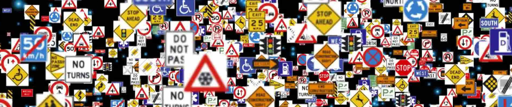
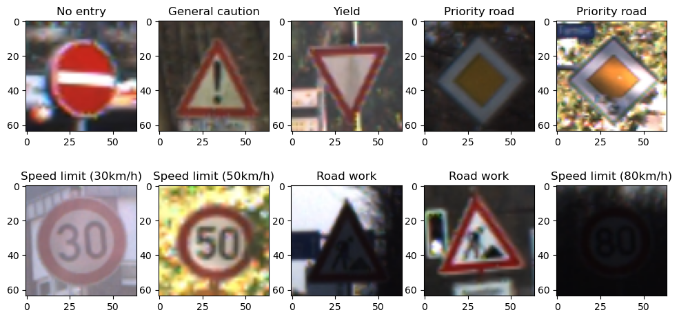
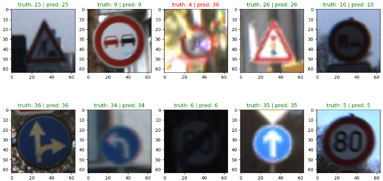

# GTSRB Traffic Vision with LeNet-5 (modified)
An image classifier using Convolutional Neural Network (CNN) to predict German traffic signs.

*source*: https://www.kaggle.com/datasets/meowmeowmeowmeowmeow/gtsrb-german-traffic-sign?select=Train.csv

# Overview dataset
German Traffic Sign Recognition Benchmark (GTSRB) is a large multi-category classification benchmark. The first was used in a competition at IJCNN 2011. The images are classified into 43 classes, consisting of 26640 training labeled images and 12630 testing set.

# Models
There are few trained models with different configuration and CNN architecture
* GTSRBModelV0 
* GTSRBModelV1 (work in progress)

# Sample Predictions

**model:** GTSRBModelV0 